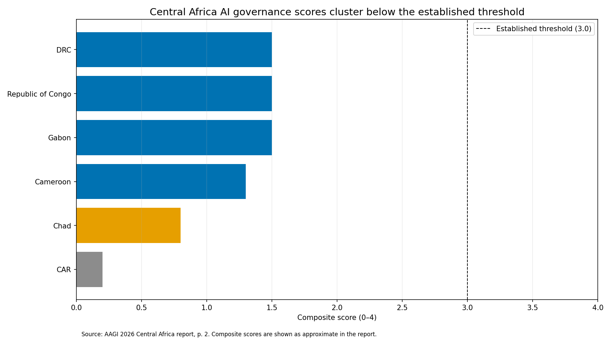
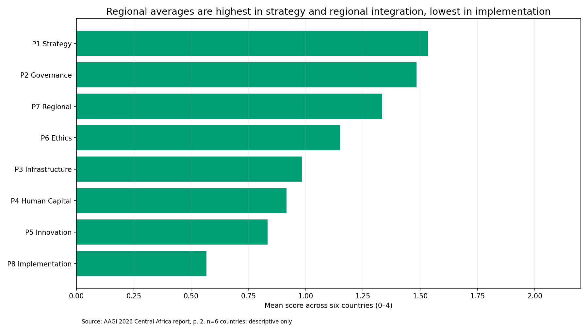
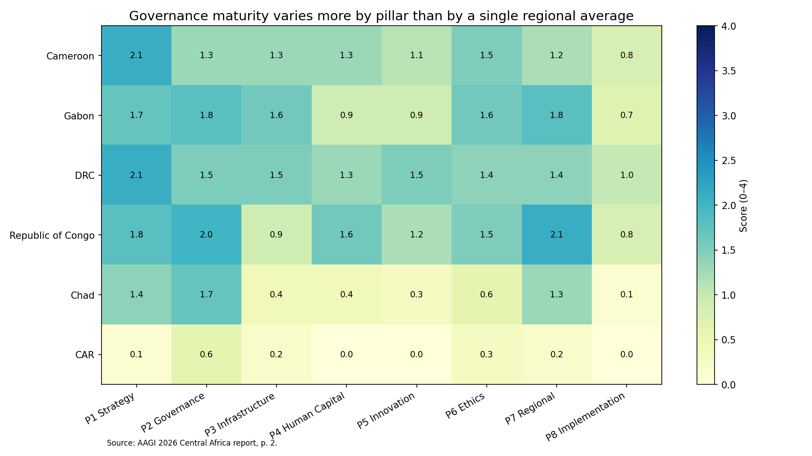
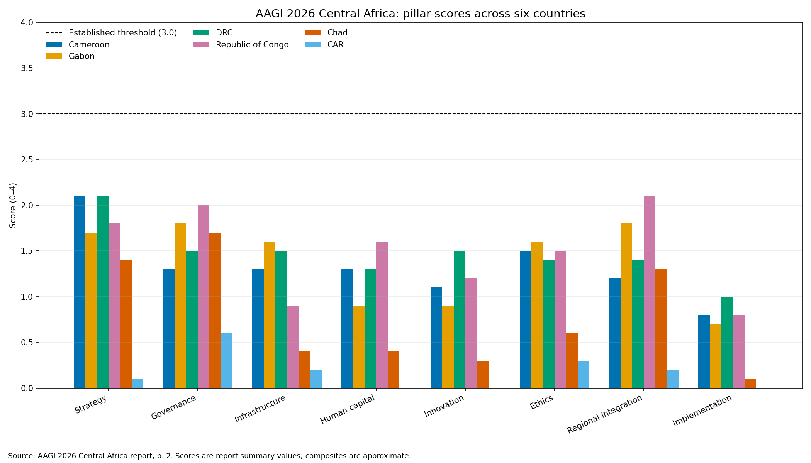
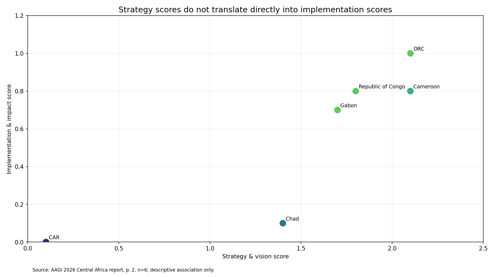
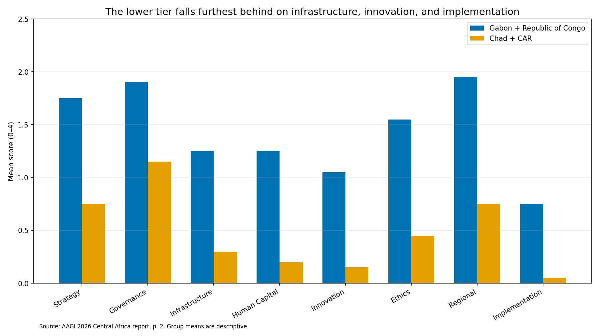
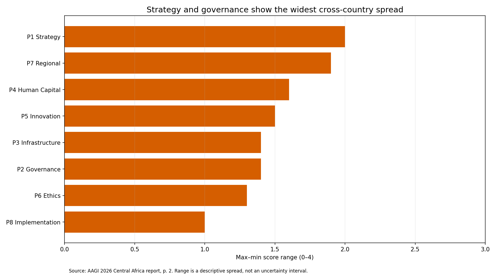
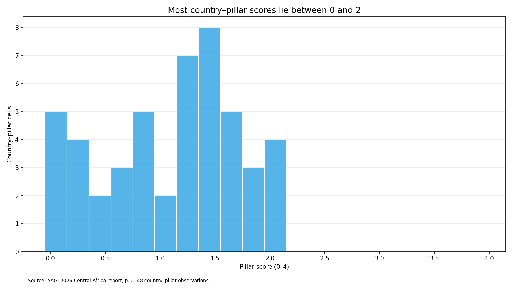
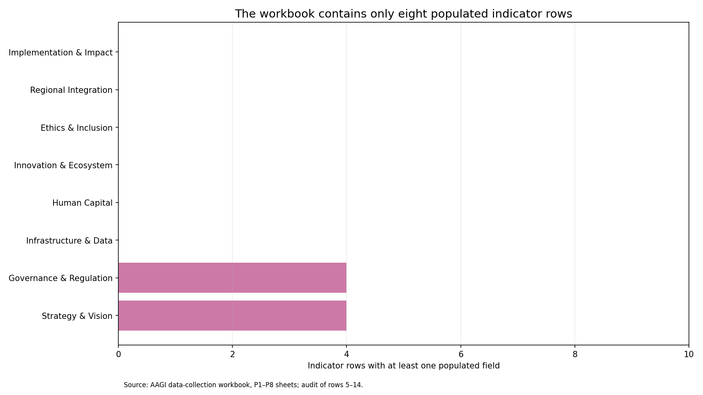

# Findings gallery — AAGI 2026 Central Africa

All charts are generated by [`code/aagi_analysis.py`](code/aagi_analysis.py) from the
report's page-2 summary. Vector versions are in [`figures/svg/`](figures/svg). Scores are
from the AAGI 2026 Central Africa report; cross-country statistics use n = 6 and are
descriptive, not inferential.

> **Scope:** these figures describe the six countries in the report's page-2 summary
> (Cameroon, Gabon, DRC, Republic of Congo, Chad, CAR). See
> [`docs/methodology_and_limitations.md`](docs/methodology_and_limitations.md).

**Headline:** All six countries fall below the *Established* threshold of 3.0; the region's
strongest pillar is *Strategy and Vision* (~1.53/4) and its weakest is *Implementation and
Impact* (~0.57/4) — an implementation gap, not an absence of policy.

---

### 1. Composite ranking
Six composites span CAR 0.2 to a three-country cluster at ~1.5; all sit below 3.0.

### 2. Regional pillar means
Strategy and governance are highest on average; implementation is lowest.

### 3. Pillar heatmap
Country profiles differ by pillar, not just by a single regional average.

### 4. Six-country profile
Full pillar breakdown for all six countries against the 3.0 threshold.

### 5. Strategy vs implementation
High strategy scores do not translate directly into implementation.

### 6. Tier comparison
The lower tier (Chad, CAR) lags most on infrastructure, innovation, and implementation.

### 7. Cross-country spread
Strategy and regional integration vary most across the six countries.

### 8. Score distribution
Most of the 48 country–pillar cells sit between 0 and 2.

### 9. Workbook completeness
Only 8 of 80 indicator rows are populated — the reproducibility limit behind the analysis.

